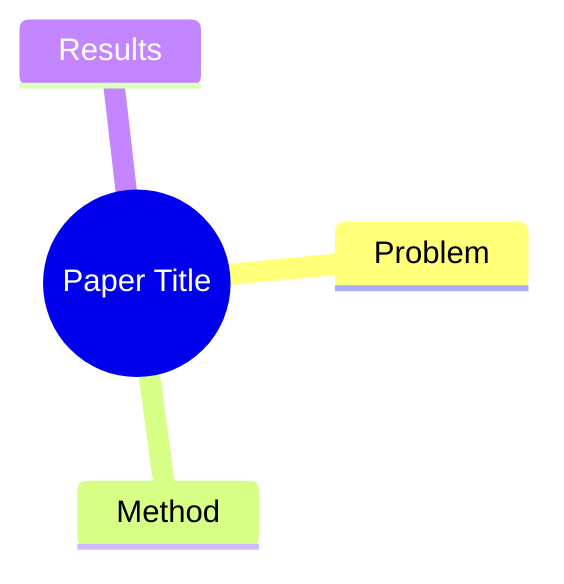

---
title:
authors: []
institute: []
date_publish:
venue:
tags: []
url:
code:
status: unread
rating:
date_added: "{{date}}"
---
## Summary
%% 一句话概括：解决了什么问题、怎么解决的 %%

## Problem & Motivation
%% 问题背景与动机，2-5 句话。为什么重要？现有方法有什么局限？ %%

## Method
%% 核心方法/架构。中文撰写，保留英文技术术语。可分段，鼓励列出关键组件。 %%

## Key Results
%% 主要实验结果，包含具体数字和 benchmark 名称。 %%

## Strengths & Weaknesses
%% 方法亮点与局限的个人评价，以及对领域的潜在影响。 %%

## Mind Map
%% root 节点用论文 ShortTitle，子节点覆盖 Problem / Method / Results 三个维度 %%

## Connections
%% 用 Grep 在 Papers/ 和 Ideas/ 中搜索方法名、任务名等关键词，填入 [[wikilinks]] %%
- Related papers:
- Related ideas:
- Related projects:

## Notes
%% 其他想法、疑问、启发。留空供后续填写。 %%
